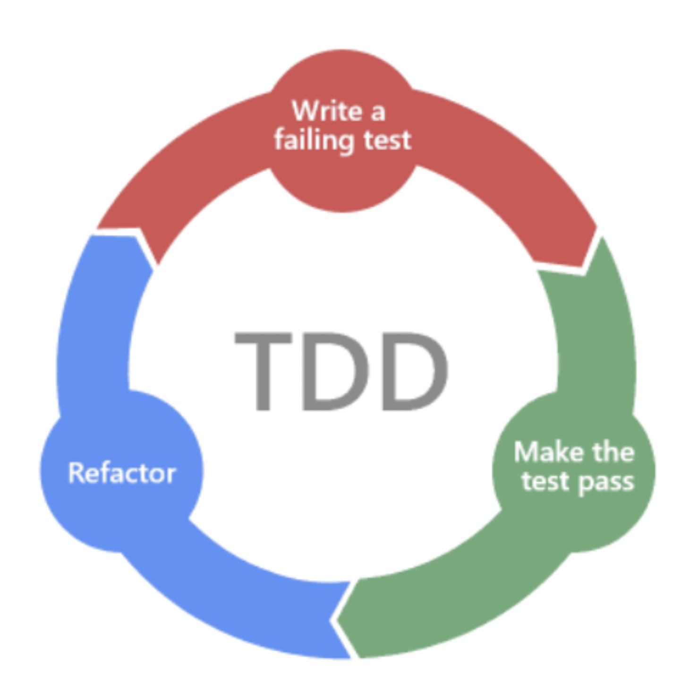

# TDD ( Test Driven Development )
### 테스트 주도 개발
> 반복 테스트를 이용한 소프트웨어의 방법론.   
> 엔지니어 Kent Beck에 의해 고안되었다.
## TDD의 개발주기

- **Red** 단계애서는 실패하는 테스트 코드를 먼저 작성한다.
- **Green** 단계에서는 테스트를 성공하기 위해 코드를 수정한다.
- **Blue** 단계에서는 코드의 리팩토링을 수행한다.
## TDD의 장점
### 높은 코드 안정성
> 짧은 주기의 테스트 코드 개발 - 리팩토링의 단계를 거치면서   
> 끊임없이 보완하고 철저한 모듈화를 통해, 종속성과 의존성이 낮은 모듈로 조합된   
> 소프트웨어 개발을 가능하게 하여 코드 안정성을 높일 수 있다.
### 재설계 시간의 단축
> 설계 단계에서 테스트 시나리오를 작성하기 때문에   
> 무엇을 해야하는지 정의하고 생각할 수 있어, 완성도 높은 설계가 가능하다.   
> 이는 추후 설계가 변경되는 것을 방지할 수 있다.
### 디버깅 시간의 단축
> 모듈 별로 테스트를 자동화 하지 않는다면 에러 발생 시 모든 레벨의 코드를 살펴봐야한다.   
> 하지만 TDD의 경우 자동화된 단위 테스트를 통해 특정 버그를 쉽게 찾을 수 있다.
   
## TDD의 단점
### 생산성의 저하
> 한번 개발할 코드를 2번 이상 반복하게 되어,   
> 일반적인 개발 방식보다 개발 시간이 늘어나 생산성이 저하된다.
### 비효율적인 테스트 코드 작성
> 단순 개발이나 프로젝트에 TDD를 적용했을 때,   
> 복사, 붙여넣기를 통한 중복된 테스트 코드는 비효율적일 수 있다.
